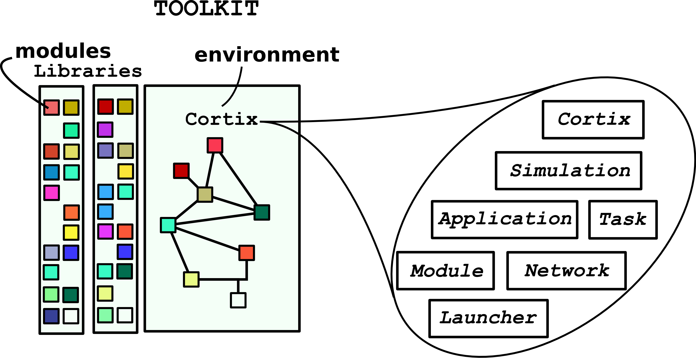

# Cortix
---
[](https://travis-ci.org/dpploy/cortix)
[](https://badge.fury.io/py/cortix)


[](https://mybinder.org/v2/gh/dpploy/cortix-nb/master)
[](http://nbviewer.jupyter.org/github/dpploy/cortix-nb/)
---


## What is Cortix?

* Cortix is a Python library for system-level module coupling, execution, and
  analysis.
* Cortix takes as input a collection of computational modules and provides an 
  environment for the coupling of those modules into a single simulation.
* Cortix handles:
    - Communication between the modules
    - Numerical integration
    - Data visualization

The basic concepts in Cortix are the creation of an `Application` and a `Simulation` involving `Tasks`.

## Pip install for users using PyPi

Cortix can be installed on any Unix-based machine or Mac OSX via pip. Run 
```
pip install --user cortix
```
to install the current version of cortix in PyPi. To install the dependencies run
```
pin install --user requirements.txt
```
where `requirements.txt` is the file in the Cortix repository.
After this first install, upgrade to newer versions
```
pip install --upgrade cortix.
```

## Repository install for latest version of Cortix

Either on a linux OS or Mac OS X, clone the Cortix repository. 
Cortix is a library and it is best used when copied to its own directory, say inside a project directory of your choice, *e.g.*, `/somepath/myproject/cortix/`, or anywhere else in your system, *e.g.*, `/somepath/cortix`. Then add either `/somepath/myproject/cortix to $PYTHONPATH` or `/somepath/cortix to $PYTHONPATH`, respectively. This is done in the Linux shell through the startup file `.bashrc`. For instance: `export $PYTHONPATH:/somepath/myproject/cortix`. A common case is:
`export $PYTHONPATH:$HOME/somepath/myproject/cortix`. Then the `.bashrc` file needs to be sourced: `source .bashrc`.

Cortix has a directory (`examples/`) that contains examples for input files, and a driver file. At the moment these input files are past files used in the development of Cortix. A driver file is needed to run Cortix. There is an example directory (`examples/console_run/`) with some examples that can be copied to say: `/somepath/driver-test.py or /somepath/myproject/driver-test.py`. Alternatively, examples can be started from the `console_run` directory, *i.e.* `droplet_run.py`. An input configuration (xml) file is also needed. An example is provided in the `examples/input/` directory (cortix-config.xml). Cortix will run each module in a separate thread. To capture the Cortix screen output of log messages (and other standard output messages), issue the bash command `/driver-cortix.py >& screen.out` under Linux (inspect the output file `screen.out` when the run is finished). Extensive logging of runtime information is stored in the `<work_dir>` directory specified in the `cortix-config.xml` input file.

## Testing

Testing is facilitated through <a href="http://pytest.org">PyTest</a>. To execute the tests, run the ```py.test``` command from the tests directory.

## Developers 

- Valmor F. de Almeida: Valmor\_deAlmeida@uml.edu
- Taha M. Azzaoui: tazzaoui@cs.uml.edu

## Documentation

- Gilberto E. Alas: gilberto\_alas@student.uml.edu
